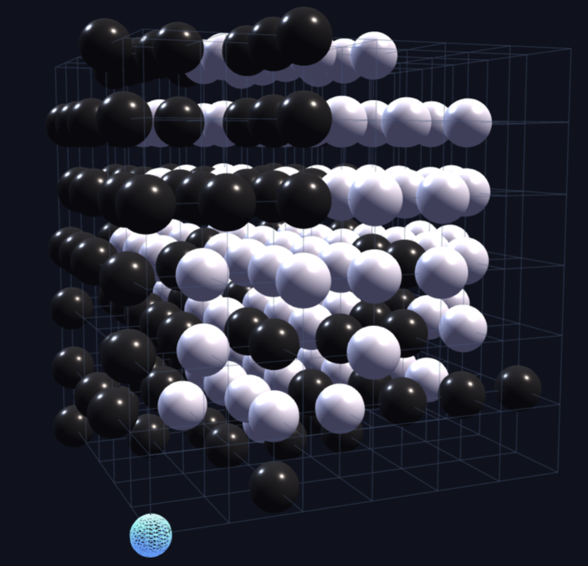

# 三维围棋 3D Go (Wallpaper Engine)

一个可玩的**单机三维围棋**，专为 Wallpaper Engine (WE) 制作，
也可以直接用浏览器打开 `index.html` 运行。

纯原生 HTML / CSS / JavaScript 实现，**零依赖、单文件**（约 40KB），
无任何外部库、无网络请求。

---

## ✨ 功能

### 对局
- **人机对战**：你执黑，AI 执白，4 档难度（简单 / 困难 / 大师 / 大师+）
- **双人同屏**：黑白轮流落子
- **AI 自动对弈**：双 AI 互弈观赏模式（适合当"活壁纸"）
- 完整围棋规则：气的计算、提子、禁着点（自杀手）
- 悔棋（人机模式自动回退两步）、停一手、认输、重开
- 棋盘大小：3³ / 5³ / 7³ / 9³ / **19³**（19³ 建议用简单/困难难度）

### 观察工具
- **三平面剖面图**（XY / XZ / YZ）：单击选点、双击直接落子，
  `‹ ›` 箭头切换层，是 3D 棋盘选点最靠谱的方式
- **XYZ 三色坐标轴**：X 红 / Y 绿 / Z 蓝，数字对齐每条网格线
- **形势判断**：中式数子法（子数 + 领地洪泛估算），黑贴 0.5 目
- **领地可视化**：蓝点 = 黑地、橙点 = 白地，实时叠加显示
- 最后一手标记（黄点）、选点确认（绿圈）

### 视图
- 拖动旋转视角、滚轮缩放（浏览器/预览中）
- 「放大 / 缩小 / 重置视角」按钮（**WE 桌面模式下可用**，因为
  WE 桌面模式不向网页转发滚轮和键盘事件）

---

## 📦 安装（Wallpaper Engine）
上线steam

https://steamcommunity.com/sharedfiles/filedetails/?id=3794810272

---

## 🎮 操作

| 操作 | 方式 |
|---|---|
| 选点 | 棋盘上单击（绿圈确认）/ 剖面图单击 |
| 落子 | **再点同一位置** / 双击 / 剖面图双击 |
| 旋转视角 | 按住拖动 |
| 缩放 | 滚轮（预览）或「视图」按钮（WE 桌面可用）|
| 悔棋 / 停一手 | 面板按钮，快捷键 U / P（仅预览）|

---

## 🧠 AI 算法

启发式打分 + Alpha-Beta 剪枝极小极大搜索：

1. **候选生成**：免克隆"落-验-撤"判定所有合法着（支持 19³）
2. **启发式排序**：提子 > 气数 > 邻接己方子 > 靠近中腹
3. **收窄候选**：只保留前 10~40 个（按难度）
4. **Alpha-Beta 搜索**：深度 1~4 层，带时间预算（0.2s ~ 20s）

| 难度 | 搜索深度 | 候选数 |
|---|---|---|
| 简单 | 0（纯启发式 + 随机）| — |
| 困难 | 1 | 20 |
| 大师 | 2 | 28 |
| 大师+ | 4 | 40（高 CPU）|

